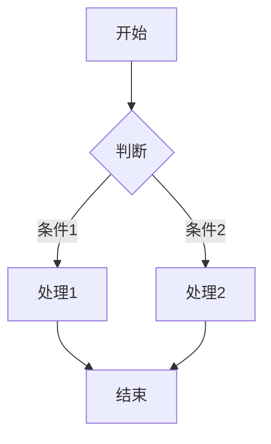

# 前端集成指南

本文档说明如何在前端项目中集成 WikiPreprocessor 的输出渲染，包括代码高亮和 Mermaid 图表。

---

## 一、代码高亮（PrismJS）

WikiPreprocessor 对围栏代码块输出 `class="language-xxx"`，前端使用 PrismJS 进行语法高亮。

### 1.1 安装

```bash
pnpm add prismjs
pnpm add -D @types/prismjs
```

### 1.2 按需加载语言和主题

```typescript
import Prism from 'prismjs';
import 'prismjs/components/prism-csharp';
import 'prismjs/components/prism-typescript';
import 'prismjs/components/prism-javascript';
import 'prismjs/components/prism-python';
import 'prismjs/themes/prism-tomorrow.css';
```

### 1.3 Vue 全局指令

```typescript
// main.ts
const vHighlight = {
    mounted(el: HTMLElement) {
        Prism.highlightElement(el);
    },
    updated(el: HTMLElement) {
        Prism.highlightElement(el);
    }
};

app.directive('highlight', vHighlight);
```

### 1.4 使用方式

```vue
<template>
    <pre><code v-highlight class="language-csharp">{{ code }}</code></pre>
</template>
```

### 1.5 推荐插件

```typescript
// 行号
import 'prismjs/plugins/line-numbers/prism-line-numbers.min.js';
import 'prismjs/plugins/line-numbers/prism-line-numbers.min.css';

// 复制按钮（需 toolbar 插件）
import 'prismjs/plugins/toolbar/prism-toolbar.min.js';
import 'prismjs/plugins/toolbar/prism-toolbar.min.css';
import 'prismjs/plugins/copy-to-clipboard/prism-copy-to-clipboard.min.js';
```

### 1.6 自定义样式

```scss
pre {
    border-radius: 8px;
    padding: 16px;
    overflow-x: auto;
    background: #1e1e1e;

    code {
        font-family: 'Fira Code', 'Consolas', monospace;
        font-size: 14px;
        line-height: 1.6;
    }
}

pre.line-numbers {
    padding-left: 56px;

    .line-numbers-rows {
        border-right: 1px solid #444;
    }
}
```

### 1.7 支持的语言

| 语言 | PrismJS 组件 |
|------|-------------|
| C# | `prism-csharp` |
| TypeScript | `prism-typescript` |
| JavaScript | `prism-javascript` |
| Python | `prism-python` |
| Java | `prism-java` |
| SQL | `prism-sql` |
| HTML/XML | `prism-markup` |
| CSS | `prism-css` |
| Bash/Shell | `prism-bash` |
| JSON | `prism-json` |
| YAML | `prism-yaml` |
| Markdown | `prism-markdown` |
| Rust | `prism-rust` |
| Go | `prism-go` |

---

## 二、Mermaid 图表渲染

WikiPreprocessor 对 ` ```mermaid ` 代码块输出 `<pre class="mermaid">...</pre>`，前端使用 mermaid.js 渲染为 SVG。

### 2.1 安装

```bash
pnpm add mermaid
```

### 2.2 Vue 组件集成

```vue
<script setup lang="ts">
import { onMounted, watch, nextTick } from 'vue';
import mermaid from 'mermaid';

const props = defineProps<{
    content: string;  // WikiPreprocessor 输出的 HTML
}>();

onMounted(() => {
    mermaid.initialize({
        startOnLoad: false,
        theme: 'default',  // 'default' | 'dark' | 'forest' | 'neutral'
    });
    renderMermaid();
});

watch(() => props.content, () => {
    nextTick(() => renderMermaid());
});

async function renderMermaid() {
    // 只渲染未处理过的元素
    const elements = document.querySelectorAll('pre.mermaid:not([data-processed])');
    
    for (const el of elements) {
        const graphDefinition = el.textContent || '';
        try {
            const id = `mermaid-${Math.random().toString(36).slice(2)}`;
            const { svg } = await mermaid.render(id, graphDefinition);
            el.innerHTML = svg;
            el.setAttribute('data-processed', 'true');
        } catch (e) {
            console.error('Mermaid render failed:', e);
            el.classList.add('mermaid-error');
        }
    }
}
</script>

<template>
    <div class="wiki-content" v-html="content"></div>
</template>

<style scoped lang="scss">
.wiki-content {
    :deep(pre.mermaid) {
        background: transparent;
        display: flex;
        justify-content: center;

        svg {
            max-width: 100%;
        }

        &.mermaid-error {
            color: #e74c3c;
            font-family: monospace;
            white-space: pre;
            justify-content: flex-start;
        }
    }
}
</style>
```

### 2.3 与 PrismJS 共存

PrismJS 的 `highlightAll()` 只匹配 `code[class^="language-"]`，不会处理 `.mermaid`，两者无冲突：

```typescript
// 先高亮代码块
Prism.highlightAll();

// 再渲染 mermaid 图表
renderMermaid();
```

### 2.4 支持的图表类型

Mermaid 支持：flowchart、sequenceDiagram、classDiagram、stateDiagram、ER diagram、Gantt、Pie、Git graph、User Journey、C4Context 等。

### 2.5 示例

输入：

````markdown

````

WikiPreprocessor 输出：

```html
<pre class="mermaid">graph TD;
    A[开始] --> B{判断};
    B -->|条件1| C[处理1];
    B -->|条件2| D[处理2];
    C --> E[结束];
    D --> E;</pre>
```

前端渲染为 SVG 流程图。

---

## 三、LaTeX 数学公式渲染

WikiPreprocessor 支持标准 LaTeX 语法：
- **行内公式**：`$...$` → `<span class="latex-inline">...</span>`
- **块级公式**：`$$...$$`（独占一行）→ `<pre class="latex">...</pre>`

前端使用 KaTeX 或 MathJax 渲染。

### 3.1 语法示例

**行内公式**：
```markdown
质能方程 $E = mc^2$ 由爱因斯坦提出
```
输出：
```html
<p>质能方程 <span class="latex-inline">E = mc^2</span> 由爱因斯坦提出</p>
```

**块级公式**：
```markdown
$$\begin{aligned}
\nabla \cdot \mathbf{E} &= \frac{\rho}{\varepsilon_0} \\
\nabla \times \mathbf{E} &= -\frac{\partial \mathbf{B}}{\partial t}
\end{aligned}$$
```
输出：
```html
<pre class="latex">\begin{aligned}
\nabla \cdot \mathbf{E} &= \frac{\rho}{\varepsilon_0} \\
\nabla \times \mathbf{E} &= -\frac{\partial \mathbf{B}}{\partial t}
\end{aligned}</pre>
```

### 3.2 安装 KaTeX

```bash
pnpm add katex
pnpm add -D @types/katex
```

### 3.3 Vue 组件集成

```vue
<script setup lang="ts">
import { onMounted, watch, nextTick } from 'vue';
import katex from 'katex';
import 'katex/dist/katex.min.css';

const props = defineProps<{
    content: string;  // WikiPreprocessor 输出的 HTML
}>();

onMounted(() => {
    renderLatex();
});

watch(() => props.content, () => {
    nextTick(() => renderLatex());
});

function renderLatex() {
    // 1. 渲染块级公式
    const blockElements = document.querySelectorAll('pre.latex:not([data-processed])');
    for (const el of blockElements) {
        const latexSource = el.textContent || '';
        try {
            const html = katex.renderToString(latexSource, {
                throwOnError: false,
                displayMode: true,  // 块级公式，居中显示
            });
            el.innerHTML = html;
            el.setAttribute('data-processed', 'true');
        } catch (e) {
            console.error('KaTeX block render failed:', e);
            el.classList.add('latex-error');
        }
    }

    // 2. 渲染行内公式
    const inlineElements = document.querySelectorAll('span.latex-inline:not([data-processed])');
    for (const el of inlineElements) {
        const latexSource = el.textContent || '';
        try {
            const html = katex.renderToString(latexSource, {
                throwOnError: false,
                displayMode: false,  // 行内公式
            });
            el.innerHTML = html;
            el.setAttribute('data-processed', 'true');
        } catch (e) {
            console.error('KaTeX inline render failed:', e);
            el.classList.add('latex-error');
        }
    }
}
</script>

<template>
    <div class="wiki-content" v-html="content"></div>
</template>

<style scoped lang="scss">
.wiki-content {
    :deep(pre.latex) {
        background: transparent;
        display: flex;
        justify-content: center;
        padding: 16px;

        .katex-display {
            margin: 0;
        }

        &.latex-error {
            color: #e74c3c;
            font-family: monospace;
            white-space: pre;
            justify-content: flex-start;
        }
    }

    :deep(span.latex-inline) {
        .katex {
            font-size: 1em;
        }

        &.latex-error {
            color: #e74c3c;
        }
    }
}
</style>
```

### 3.4 使用 MathJax 作为替代

如果偏好 MathJax（支持更多 LaTeX 宏包）：

```bash
pnpm add mathjax
```

```typescript
import { mathjax } from 'mathjax';
import { TeX } from 'mathjax/input/tex.js';
import { SVG } from 'mathjax/output/svg.js';

const tex = new TeX({ packages: ['base', 'ams', 'noerrors', 'noundefined'] });
const svg = new SVG({ fontCache: 'local' });
const html = mathjax.document('', { InputJax: tex, OutputJax: svg });

function renderLatexMathJax(latexSource: string, displayMode: boolean): string {
    const node = html.convert(latexSource, { display: displayMode });
    return html.adaptor.outerHTML(node);
}
```

### 3.5 与 PrismJS / Mermaid 共存

四种特殊元素互不冲突：

```typescript
function renderAll() {
    // 1. 代码高亮
    Prism.highlightAll();
    // 2. Mermaid 图表
    renderMermaid();
    // 3. LaTeX 公式（块级 + 行内）
    renderLatex();
}
```

---

## 四、渲染顺序总结

```
Wiki HTML 输出
    │
    ├── 普通文本 ──→ 直接显示
    │
    ├── <span class="latex-inline"> ──→ KaTeX.renderToString(displayMode: false)
    │
    ├── <pre><code class="language-xxx"> ──→ PrismJS.highlightElement()
    │
    ├── <pre class="mermaid"> ──→ mermaid.render()
    │
    └── <pre class="latex"> ──→ KaTeX.renderToString(displayMode: true)
```

**注意**：Mermaid 和 LaTeX 渲染必须在 DOM 挂载后执行，且内容更新时需要重新渲染。
